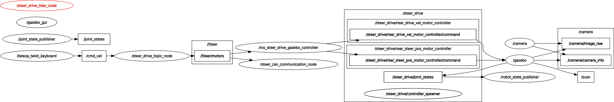

# steer_drive-ros

## Rosgraph şeması
<br/><br/>

## To run on parkur 
````bash
roslaunch steer_drive_description controller+world.launch
````
## Slam launch
````bash
roslaunch steer_drive_autonomous slam.launch
````
## To connect real lidar + camera + CAN
````bash
roslaunch steer_drive_bringup steer_drive_robot.launch
````
## To connect devices and launch autonomous
````bash
roslaunch steer_drive_bringup connect&autonomous.launch
````

## Packages must install
````bash
sudo apt install ros-noetic-position-controllers -y
sudo apt install ros-noetic-velocity-controllers -y
sudo apt install ros-noetic-teleop-twist-keyboard -y
sudo apt install ros-noetic-control* -y
sudo apt-get install zbar-tools -y
sudo apt install ros-noetic-rosbridge-server -y
sudo apt-get install ros-noetic-gmapping -y
sudo apt-get install ros-noetic-slam-* -y
````
# Yenilikler