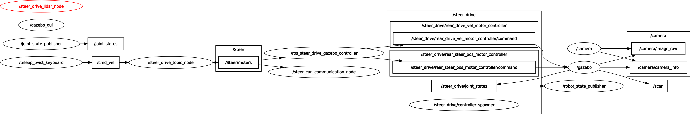

# steer_drive-ros

## Rosgraph şeması
<br/><br/>

## To run on world
````bash
roslaunch steer_drive_description controller+world.launch
````
## To connect real lidar + camera + CAN
````bash
roslaunch steer_drive_bringup steer_drive_robot.launch
````
## Packages must install
````bash
sudo apt install ros-noetic-position-controllers -y
sudo apt install ros-noetic-velocity-controllers -y
sudo apt install ros-noetic-teleop-twist-keyboard -y
sudo apt install ros-noetic-control* -y
````
